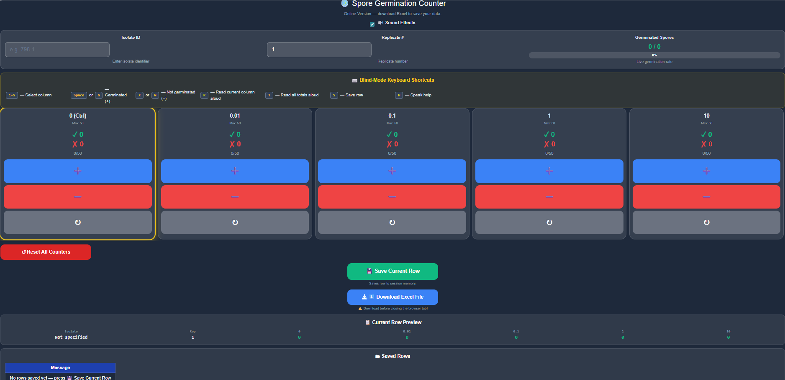

# Online spore counter
Fungal spore counter for spore germination assay (blind mode)

<details>
<summary> Required libraries </summary>
  
```
library(shiny)
  
library(openxlsx)
```

<details>
<summary> Adjusting the Spore counter webpage to mobile friendly </summary>
  
#  Mobile friendly - UI DEFINITION IN R 

```
ui <- fluidPage(
  tags$head(
    tags$meta(name="viewport",
              content="width=device-width, initial-scale=1.0, maximum-scale=1.0, user-scalable=no"),
  ```

<details>
<summary> Adding styling langage (Cascading Style Sheets) to webpage code </summary>
  
 ## Cascading Style Sheets IN R - GLOBAL STYLES 
 
 ```
    tags$style(HTML("
      html, body {
        background-color: #1e293b !important;
        color: #f8fafc !important;
        font-family: Arial, sans-serif !important;
        margin: 0; padding: 0;
        -webkit-text-size-adjust: 100%;
        touch-action: manipulation;
      }
      .container-fluid { padding: 8px 10px !important; }
      h1 { text-align:center; color:#ffffff !important; font-size:22px; margin:10px 0; }
      .top-note { text-align:center; color:#94a3b8; font-size:12px; margin-bottom:8px; }
      .sound-row {
        display:flex; align-items:center; justify-content:center;
        gap:8px; margin:6px 0; color:#94a3b8; font-size:13px;
      }
      .input-panel {
        background:rgba(255,255,255,0.1);
        border:1px solid rgba(255,255,255,0.15);
        border-radius:12px; padding:12px; margin-bottom:10px;
      }
      .panel-label {
        display:block; text-align:center;
        color:#e2e8f0 !important; font-size:12px;
        font-weight:600; margin-bottom:4px;
      }
      .sub-note { color:#94a3b8; font-size:11px; text-align:center; margin:2px 0 0; }
      .form-control {
        background:rgba(255,255,255,0.12) !important;
        color:#f8fafc !important;
        border:1px solid rgba(255,255,255,0.25) !important;
        border-radius:8px !important;
        font-size:16px !important;
        min-height:44px !important;
      }
      .form-control::placeholder { color:#64748b !important; }
      label { color:#e2e8f0 !important; }
      .counters-row {
        display:flex; flex-wrap:nowrap; gap:8px;
        width:100%; margin-bottom:10px;
        overflow-x:auto; -webkit-overflow-scrolling:touch; padding-bottom:4px;
      }
      .counter-card {
        flex:0 0 calc(20% - 7px); min-width:120px;
        background:rgba(255,255,255,0.1);
        border:1px solid rgba(255,255,255,0.15);
        border-radius:16px; padding:12px 8px;
        display:flex; flex-direction:column;
        justify-content:space-between; min-height:300px;
        transition: outline 0.1s, box-shadow 0.1s;
      }
      .counter-card.active-col {
        outline: 3px solid #facc15 !important;
        box-shadow: 0 0 22px rgba(250,204,21,0.55) !important;
      }
      .c-title { text-align:center; font-size:15px; font-weight:700; color:#e2e8f0; margin-bottom:4px; }
      .c-limit  { text-align:center; font-size:9px; color:#94a3b8; margin-bottom:4px; }
      .c-display { text-align:center; margin:6px 0; }
      .c-germ   { font-size:20px; font-weight:bold; color:#10b981; }
      .c-ngerm  { font-size:20px; font-weight:bold; color:#ef4444; }
      .c-total  { font-size:12px; color:#94a3b8; margin-top:3px; }
      .btn-cnt {
        width:100%; border:none; border-radius:12px;
        font-size:22px; font-weight:bold;
        padding:18px 4px; margin:3px 0; cursor:pointer;
        -webkit-tap-highlight-color: transparent;
        touch-action: manipulation; display:block;
        transition: transform 0.08s ease, opacity 0.08s ease, box-shadow 0.08s ease;
      }
      .btn-cnt:active { transform:scale(0.92); opacity:0.82; box-shadow: inset 0 3px 8px rgba(0,0,0,0.35); }
      .btn-inc { background:#3b82f6 !important; color:#fff !important; }
      .btn-dec { background:#ef4444 !important; color:#fff !important; }
      .btn-rst { background:#6b7280 !important; color:#fff !important; }
      .info-panel {
        background:rgba(255,255,255,0.08);
        border:1px solid rgba(255,255,255,0.1);
        border-radius:10px; padding:12px; margin-top:10px;
      }
      .panel-title { text-align:center; font-size:14px; font-weight:600; color:#fff; margin-bottom:8px; }
      .preview-row { display:flex; justify-content:space-around; flex-wrap:wrap; gap:8px; font-family:monospace; color:#e2e8f0; }
      .preview-cell { text-align:center; }
      .preview-key  { font-size:10px; color:#94a3b8; }
      .preview-val  { font-size:13px; font-weight:bold; }
      .preview-val-g { color:#10b981; }
      .germ-count { font-size:18px; font-weight:bold; color:#10b981; text-align:center; margin-bottom:4px; }
      .bar-bg { background:rgba(255,255,255,0.12); border-radius:20px; height:18px; overflow:hidden; position:relative; }
      .bar-fill { height:100%; border-radius:20px; background:linear-gradient(90deg,#10b981,#3b82f6); transition:width 0.4s ease; }
      .bar-txt { font-size:10px; font-weight:bold; color:#fff; position:absolute; left:50%; top:50%; transform:translate(-50%,-50%); white-space:nowrap; }
      .saved-table-wrap table { width:100%; border-collapse:collapse; color:#f8fafc !important; font-size:13px; }
      .saved-table-wrap table thead tr th { background:#1e40af !important; color:#ffffff !important; padding:8px 10px; text-align:center; font-weight:700; border:1px solid rgba(255,255,255,0.15); }
      .saved-table-wrap table tbody tr td { background:#1e293b !important; color:#f8fafc !important; padding:7px 10px; text-align:center; border:1px solid rgba(255,255,255,0.1); }
      .saved-table-wrap table tbody tr:hover td { background:rgba(59,130,246,0.2) !important; }
      .action-btn-wrap { text-align:center; margin-top:10px; }
      .action-btn-wrap p { color:#94a3b8; font-size:10px; margin:4px 0 0; }
      .shiny-notification { background:#0f172a !important; color:#f8fafc !important; border:1px solid #3b82f6 !important; }
      #download_excel { width:260px; font-size:14px; font-weight:600; padding:12px; background:#3b82f6 !important; color:#fff !important; border:none !important; border-radius:12px !important; -webkit-tap-highlight-color:transparent; }
      .shiny-input-container { margin-bottom:4px !important; }
```

  <details>
<summary> Spore counter keyboard shortcuts (Cascading Style Sheets) to webpage </summary>

## Cascading Style Sheets IN R - KEYBOARD SHORTCUTS 
 
 ```
      .kbd-panel {
        background:rgba(250,204,21,0.08);
        border:1px solid rgba(250,204,21,0.3);
        border-radius:10px; padding:10px 14px; margin-top:10px;
      }
      .kbd-panel .panel-title { color:#facc15; }
      .kbd-grid { display:grid; grid-template-columns: repeat(auto-fill, minmax(170px,1fr)); gap:5px 14px; }
      .kbd-row { display:flex; align-items:center; gap:6px; font-size:12px; color:#e2e8f0; }
      .kbd-key {
        display:inline-block; background:#334155; border:1px solid #64748b;
        border-radius:5px; padding:1px 7px; font-size:11px; font-weight:700;
        color:#facc15; font-family:monospace; white-space:nowrap;
      }

```

<details>
<summary> Spore counter cursor-tip (Cascading Style Sheets) to webpage </summary>
  
 ## Cascading Style Sheets IN R  - cursor-tip
 
 ```
      #cursor-tip {
        position:fixed; pointer-events:none; z-index:9999;
        padding:5px 10px; border-radius:8px; font-size:13px; font-weight:700;
        white-space:nowrap; opacity:0; transform:translate(14px,-50%);
        transition:opacity 0.12s ease; box-shadow:0 2px 10px rgba(0,0,0,0.4);
        letter-spacing:0.3px;
      }
      #cursor-tip.tip-inc   { background:#3b82f6; color:#fff; }
      #cursor-tip.tip-dec   { background:#ef4444; color:#fff; }
      #cursor-tip.tip-reset { background:#6b7280; color:#fff; }
      #cursor-tip.tip-save  { background:#10b981; color:#fff; }
      #cursor-tip.tip-dl    { background:#1e40af; color:#fff; }
      #cursor-tip.tip-rst-all { background:#dc2626; color:#fff; }
      #cursor-tip.visible   { opacity:1; }
    ")),
```    
 <details>
<summary> JAVA script for webpage features </summary>
  
 ## JAVA SCRIPT IN R - Phone vibration
 
 ```
    tags$script(HTML("
      function vibe(p){ if(navigator.vibrate){ try{navigator.vibrate(p);}catch(e){} } }
      var haptic={
        inc:      function(){ vibe(12); },
        dec:      function(){ vibe([8,30,8]); },
        reset:    function(){ vibe([20,40,20]); },
        save:     function(){ vibe([10,50,10,50,30]); },
        autosave: function(){ vibe([15,40,15,40,15,40,60]); },
        warn:     function(){ vibe([40,30,40,30,40]); },
        select:   function(){ vibe([5,20,5]); }
      };
```
 ## JAVA SCRIPT IN R - SPORE COUNTING AUDIO 
```
      var soundEnabled=true, audioCtx=null;
      function getCtx(){ if(!audioCtx) audioCtx=new(window.AudioContext||window.webkitAudioContext)(); return audioCtx; }
      function tone(f,t,d,v){
        if(!soundEnabled)return;
        try{
          var c=getCtx(),o=c.createOscillator(),g=c.createGain();
          o.connect(g);g.connect(c.destination);
          o.type=t;o.frequency.setValueAtTime(f,c.currentTime);
          o.frequency.exponentialRampToValueAtTime(f*0.8,c.currentTime+d);
          g.gain.setValueAtTime(v,c.currentTime);
          g.gain.exponentialRampToValueAtTime(0.001,c.currentTime+d);
          o.start(c.currentTime);o.stop(c.currentTime+d);
        }catch(e){}
      }
      var snd={
        inc1:function(){tone(220,'sine',0.10,0.35);setTimeout(function(){tone(277,'sine',0.07,0.18);},55);},
        inc2:function(){tone(440,'triangle',0.09,0.09);setTimeout(function(){tone(554,'triangle',0.06,0.07);},45);},
        inc3:function(){tone(660,'sine',0.08,0.07);setTimeout(function(){tone(880,'sine',0.06,0.06);},35);},
        inc4:function(){tone(800,'square',0.05,0.05);setTimeout(function(){tone(1000,'square',0.04,0.04);},30);},
        inc5:function(){tone(1200,'sine',0.12,0.18);setTimeout(function(){tone(1500,'sine',0.07,0.12);},60);},
        dec1:function(){tone(165,'sine',0.10,0.12);setTimeout(function(){tone(130,'sine',0.07,0.10);},55);},
        dec2:function(){tone(330,'triangle',0.09,0.09);setTimeout(function(){tone(277,'triangle',0.06,0.07);},45);},
        dec3:function(){tone(494,'sine',0.08,0.07);setTimeout(function(){tone(392,'sine',0.05,0.06);},35);},
        dec4:function(){tone(600,'square',0.05,0.05);setTimeout(function(){tone(500,'square',0.03,0.04);},30);},
        dec5:function(){tone(900,'sine',0.10,0.12);setTimeout(function(){tone(750,'sine',0.06,0.10);},55);},
        reset:function(){tone(600,'square',0.05,0.15);setTimeout(function(){tone(400,'square',0.05,0.1);},30);},
        save:function(){tone(523,'sine',0.15,0.3);setTimeout(function(){tone(659,'sine',0.15,0.3);},120);setTimeout(function(){tone(784,'sine',0.2,0.4);},240);},
        autosave:function(){
          tone(523,'sine',0.15,0.35);
          setTimeout(function(){tone(659,'sine',0.15,0.35);},100);
          setTimeout(function(){tone(784,'sine',0.15,0.35);},200);
          setTimeout(function(){tone(1047,'sine',0.25,0.5);},300);
        },
        warn:function(){
          if(!soundEnabled)return;
          try{
            var c=getCtx();
            [853,960].forEach(function(f){
              var o=c.createOscillator(),g=c.createGain();
              o.connect(g);g.connect(c.destination);
              o.type='square';o.frequency.setValueAtTime(f,c.currentTime);
              g.gain.setValueAtTime(0,c.currentTime);
              g.gain.linearRampToValueAtTime(0.3,c.currentTime+0.01);
              g.gain.setValueAtTime(0.3,c.currentTime+0.24);
              g.gain.linearRampToValueAtTime(0,c.currentTime+0.25);
              o.start(c.currentTime);o.stop(c.currentTime+0.25);
            });
          }catch(e){}
        },
        // distinct column-select tones (rising pitch per column)
        selectCol:function(col1){
          var freqs=[300,380,460,560,680];
          tone(freqs[col1-1],'sine',0.12,0.25);
        }
      };
      function toggleSound(cb){ soundEnabled=cb.checked; }
```
  ## JAVA SCRIPT IN R - SPORE COUNTER AUDIO 
```   
     var synth=window.speechSynthesis||null;
      function speak(txt){
        if(!soundEnabled)return;
        if(!synth)return;
        synth.cancel();
        var u=new SpeechSynthesisUtterance(txt);
        u.rate=1.4; u.pitch=1.05; u.volume=1.0;
        synth.speak(u);
      }
      function speakQ(txt){
        // queued speak (does not cancel current)
        if(!soundEnabled)return;
        if(!synth)return;
        var u=new SpeechSynthesisUtterance(txt);
        u.rate=1.4; u.pitch=1.05; u.volume=1.0;
        synth.speak(u);
      }
```
## JAVA SCRIPT IN R - SPORE COUNTER TRACK AUDIO - BLIND-MODE STATE  
```    
      var activeCol = 1;  // 1-5
      var colNames  = ['Control','Zero point zero one','Zero point one','One','Ten'];
      var colShort  = ['Ctrl','0.01','0.1','1','10'];
      // local mirror — updated by syncCounts custom message from server
      var gCounts = [0,0,0,0,0];
      var nCounts = [0,0,0,0,0];

      function highlightActiveCol(){
        for(var i=1;i<=5;i++){
          var cards=document.querySelectorAll('.counter-card');
          if(cards[i-1]){
            if(i===activeCol) cards[i-1].classList.add('active-col');
            else              cards[i-1].classList.remove('active-col');
          }
        }
      }

      function announceSelect(){
        var c=activeCol-1;
        var g=gCounts[c], n=nCounts[c], tot=g+n;
        snd.selectCol(activeCol);
        haptic.select();
        speak('Column ' + colNames[c] + '. ' + g + ' germinated. ' + n + ' not. ' + tot + ' of 50.');
        highlightActiveCol();
      }

      function announceAction(col0, action){
        var g=gCounts[col0], n=nCounts[col0], tot=g+n;
        var rem=50-tot;
        var msg=action + '. ' + colNames[col0] + '. ' + tot + ' of 50.';
        if(rem>0 && rem<=5) msg += ' ' + rem + ' to go.';
        if(tot===50) msg='Column complete. ' + colNames[col0] + '. ' + g + ' germinated, ' + n + ' not.';
        speak(msg);
      }

 ```    
 ## JAVA SCRIPT IN R - KEYBOARD TRACKING AND ITS TRACKING

 | Web features | Keboards shortcuts |
|---|---|
| select column| 1-5 |
| germinated  (+) | Space/G |
|  not germinated (-) | X / N |
| read active column status | R |
| read total all columns | T  |
| save row | S |
| help|  H / ? |

  
```
      document.addEventListener('keydown',function(e){
        var tag=(e.target||{}).tagName;
        if(tag==='INPUT'||tag==='TEXTAREA'||tag==='SELECT') return;
        var k=e.key;

        // ── select column 1-5 ──
        if(k>='1'&&k<='5'){
          e.preventDefault();
          activeCol=parseInt(k);
          announceSelect();
          return;
        }
```
 ## JAVA SCRIPT IN R - KEYBOARD TRACKING FOR GERMINATED
  
```
        if(k===' '||k==='g'||k==='G'){
          e.preventDefault();
          var c=activeCol-1;
          if(gCounts[c]+nCounts[c]<50){
            gCounts[c]++;
            haptic.inc();
            snd['inc'+activeCol]();
            Shiny.setInputValue('increment'+activeCol,Math.random(),{priority:'event'});
            announceAction(c,'Plus');
          } else {
            haptic.warn(); snd.warn();
            speak('Column full. 50 of 50.');
          }
          return;
        }
```
 ## JAVA SCRIPT IN R - KEYBOARD TRACKING FOR NON -GERMINATED

  ``` 
        if(k==='x'||k==='X'||k==='n'||k==='N'){
          e.preventDefault();
          var c=activeCol-1;
          if(gCounts[c]+nCounts[c]<50){
            nCounts[c]++;
            haptic.dec();
            snd['dec'+activeCol]();
            Shiny.setInputValue('decrement'+activeCol,Math.random(),{priority:'event'});
            announceAction(c,'Minus');
          } else {
            haptic.warn(); snd.warn();
            speak('Column full. 50 of 50.');
          }
          return;
        }
```
## JAVA SCRIPT IN R - READ ACTIVE COULMN
```
        if(k==='r'||k==='R'){
          e.preventDefault();
          var c=activeCol-1;
          speak('Column ' + colNames[c] + '. Germinated: ' + gCounts[c] + '. Not germinated: ' + nCounts[c] + '. Total: ' + (gCounts[c]+nCounts[c]) + ' of 50.');
          return;
        }
```
 ## JAVA SCRIPT IN R - KEYBOARD TRACKING FOR TOTAL GERMINATED SPORES
  
  ```
        if(k==='t'||k==='T'){
          e.preventDefault();
          var grand=0, parts=[];
          for(var i=0;i<5;i++){
            var tot=gCounts[i]+nCounts[i]; grand+=tot;
            parts.push(colShort[i]+': '+gCounts[i]+' germinated, '+tot+' counted');
          }
          speak('Total: '+grand+' of 250. '+parts.join('. ')+'.');
          return;
        }
```
 ## JAVA SCRIPT IN R - SAVE THE ROW
  
  ```
        if(k==='s'||k==='S'){
          e.preventDefault();
          haptic.save(); snd.save();
          Shiny.setInputValue('manual_save',Math.random(),{priority:'event'});
          speak('Row saved.');
          return;
        }
```

 ## JAVA SCRIPT IN R - HELP TO UNDERSTAND THE WEBPAGE FEATURES
   
   ```
        if(k==='h'||k==='H'||k==='?'){
          e.preventDefault();
          speak('Keyboard shortcuts: Press 1 to 5 to select a column. Space or G to count germinated. X or N to count not germinated. R to hear current column. T to hear all totals. S to save the row.');
          return;
        }
      });
```
     
## JAVA SCRIPT IN R - R RECEIVE COUNT SYNC FROM SERVER

   ```
      $(document).on('shiny:connected',function(){
        Shiny.addCustomMessageHandler('syncCounts',function(m){
          gCounts=m.g; nCounts=m.n;
        });
        Shiny.addCustomMessageHandler('playAutoSave',function(m){
          haptic.autosave(); snd.autosave();
          gCounts=[0,0,0,0,0]; nCounts=[0,0,0,0,0];
          speak('Auto saved. All 250 counted. Column 1 active.');
          activeCol=1; highlightActiveCol();
        });
        Shiny.addCustomMessageHandler('playWarning',function(m){ haptic.warn(); snd.warn(); });
        Shiny.addCustomMessageHandler('setUnsaved', function(m){ hasUnsaved=m.unsaved; });
      });
```

 ## JAVA SCRIPT IN R - BUTTON CLICK BRIDGE BETWEEN R AND JAVA (mouse/touch)
  
  ```   
      var bridged=false;
      function attachBridge(){
        if(bridged)return; bridged=true;
        var INC={'increment1':snd.inc1,'increment2':snd.inc2,'increment3':snd.inc3,'increment4':snd.inc4,'increment5':snd.inc5};
        var DEC={'decrement1':snd.dec1,'decrement2':snd.dec2,'decrement3':snd.dec3,'decrement4':snd.dec4,'decrement5':snd.dec5};
        var RST=['reset1','reset2','reset3','reset4','reset5','reset_all'];
        var ALL=['increment1','decrement1','reset1',
                 'increment2','decrement2','reset2',
                 'increment3','decrement3','reset3',
                 'increment4','decrement4','reset4',
                 'increment5','decrement5','reset5','reset_all'];
        document.body.addEventListener('click',function(e){
          var el=e.target;
          var id=el.id||(el.closest&&el.closest('button')?el.closest('button').id:'');
          if(!id)return;
          if(INC[id]){      haptic.inc();   INC[id](); }
          else if(DEC[id]){ haptic.dec();   DEC[id](); }
          else if(RST.indexOf(id)>-1){ haptic.reset(); snd.reset(); }
          else if(id==='manual_save'){ haptic.save(); snd.save(); }
          if(ALL.indexOf(id)>-1) Shiny.setInputValue(id,Math.random(),{priority:'event'});
        },true);
 ```
       
  ## JAVA SCRIPT IN R - Announce on page load
   
   ```
        setTimeout(function(){
          speak('Spore counter ready. Column 1, Control, active. Press H for help.');
          highlightActiveCol();
        },800);
      }
      $(document).on('shiny:idle',attachBridge);
      $(document).ready(function(){ setTimeout(attachBridge,400); });

      var hasUnsaved=false;
      window.addEventListener('beforeunload',function(e){
        if(hasUnsaved){
          var msg='You have unsaved spore data! Please download your Excel file before leaving.';
          e.preventDefault(); e.returnValue=msg; return msg;
        }
      });
```

## JAVA SCRIPT IN R - CURSOR TOOLTIP + VOICE HOVER (mouse)

 ```  
      (function(){
        var tip=document.createElement('div');
        tip.id='cursor-tip';
        document.body.appendChild(tip);
        var colNames2=['Control','0.01','0.1','1','10'];
        var tipMap={
          increment1:'➕ Plus — Control',    increment2:'➕ Plus — 0.01',
          increment3:'➕ Plus — 0.1',        increment4:'➕ Plus — 1',        increment5:'➕ Plus — 10',
          decrement1:'➖ Minus — Control',   decrement2:'➖ Minus — 0.01',
          decrement3:'➖ Minus — 0.1',       decrement4:'➖ Minus — 1',       decrement5:'➖ Minus — 10',
          reset1:'↻ Reset — Control',       reset2:'↻ Reset — 0.01',
          reset3:'↻ Reset — 0.1',           reset4:'↻ Reset — 1',           reset5:'↻ Reset — 10',
          reset_all:'↺ Reset ALL Counters', manual_save:'💾 Save Row',       download_excel:'⬇️ Download Excel'
        };
        var speakMap={
          increment1:'Plus. Control.',        increment2:'Plus. Zero point zero one.',
          increment3:'Plus. Zero point one.', increment4:'Plus. One.',          increment5:'Plus. Ten.',
          decrement1:'Minus. Control.',       decrement2:'Minus. Zero point zero one.',
          decrement3:'Minus. Zero point one.',decrement4:'Minus. One.',         decrement5:'Minus. Ten.',
          reset1:'Reset. Control.',           reset2:'Reset. Zero point zero one.',
          reset3:'Reset. Zero point one.',    reset4:'Reset. One.',             reset5:'Reset. Ten.',
          reset_all:'Reset all counters.',    manual_save:'Save row.',          download_excel:'Download Excel.'
        };
        var classMap={
          increment1:'tip-inc',  increment2:'tip-inc',  increment3:'tip-inc',  increment4:'tip-inc',  increment5:'tip-inc',
          decrement1:'tip-dec',  decrement2:'tip-dec',  decrement3:'tip-dec',  decrement4:'tip-dec',  decrement5:'tip-dec',
          reset1:'tip-reset',    reset2:'tip-reset',    reset3:'tip-reset',    reset4:'tip-reset',    reset5:'tip-reset',
          reset_all:'tip-rst-all', manual_save:'tip-save', download_excel:'tip-dl'
        };
        document.addEventListener('mousemove',function(e){ tip.style.left=e.clientX+'px'; tip.style.top=e.clientY+'px'; });
        var lastId='';
        document.addEventListener('mouseover',function(e){
          var el=e.target&&e.target.closest?e.target.closest('button,.btn-cnt,#download_excel'):null;
          if(!el){ tip.className=''; return; }
          var id=el.id||'';
          if(id===lastId)return;
          lastId=id;
          if(tipMap[id]){
            tip.textContent=tipMap[id];
            tip.className=classMap[id]+' visible';
            speak(speakMap[id]);
          } else { tip.className=''; }
        });
        document.addEventListener('mouseout',function(e){
          var to=e.relatedTarget&&e.relatedTarget.closest?e.relatedTarget.closest('button,.btn-cnt,#download_excel'):null;
          if(!to){ tip.className=tip.className.replace(' visible',''); lastId=''; if(synth)synth.cancel(); }
        });
      })();
    "))
  ),

  h1("🧫 Spore Germination Counter"),
  div(class="top-note", "Online Version — download Excel to save your data."),

  div(class="sound-row",
      tags$input(type="checkbox", id="soundToggle", checked=NA, onchange="toggleSound(this)"),
      tags$label(`for`="soundToggle", "🔊 Sound Effects")),

  div(class="input-panel",
      fluidRow(
        column(4,
               tags$span(class="panel-label","Isolate ID"),
               textInput("main_isolate", NULL, value="", placeholder="e.g. 798.1"),
               p(class="sub-note","Enter isolate identifier")),
        column(4,
               tags$span(class="panel-label","Replicate #"),
               numericInput("rep_number", NULL, value=1, min=1, max=999),
               p(class="sub-note","Replicate number")),
        column(4,
               tags$span(class="panel-label","Germinated Spores"),
               uiOutput("germ_bar_ui"),
               p(class="sub-note","Live germination rate"))
      )),
```

## JAVA SCRIPT IN R - KEYBOARD CHEETSHEET ON THE WEBPAGE

 ```
  div(class="kbd-panel",
      div(class="panel-title", "⌨️ Blind-Mode Keyboard Shortcuts"),
      div(class="kbd-grid",
          div(class="kbd-row", tags$span(class="kbd-key","1–5"),   " — Select column"),
          div(class="kbd-row", tags$span(class="kbd-key","Space"), " or ", tags$span(class="kbd-key","G"), " — Germinated (+)"),
          div(class="kbd-row", tags$span(class="kbd-key","X"),     " or ", tags$span(class="kbd-key","N"), " — Not germinated (−)"),
          div(class="kbd-row", tags$span(class="kbd-key","R"),     " — Read current column aloud"),
          div(class="kbd-row", tags$span(class="kbd-key","T"),     " — Read all totals aloud"),
          div(class="kbd-row", tags$span(class="kbd-key","S"),     " — Save row"),
          div(class="kbd-row", tags$span(class="kbd-key","H"),     " — Speak help")
      )),

  div(class="counters-row",
      lapply(1:5, function(i){
        labels <- c("0 (Ctrl)","0.01","0.1","1","10")
        div(class="counter-card",
            div(class="c-title", labels[i]),
            div(class="c-limit","Max: 50"),
            uiOutput(paste0("count",i,"_display")),
            tags$button("➕", id=paste0("increment",i), class="btn-cnt btn-inc"),
            tags$button("➖", id=paste0("decrement",i), class="btn-cnt btn-dec"),
            tags$button("↻",  id=paste0("reset",i),     class="btn-cnt btn-rst"))
      })),

  div(class="action-btn-wrap",
      tags$button("↺  Reset All Counters", id="reset_all", class="btn-cnt",
                  style="width:260px;background:#dc2626!important;color:#fff;
                         font-size:14px;padding:12px;border-radius:12px;
                         border:none;cursor:pointer;")),

  div(class="action-btn-wrap",
      actionButton("manual_save","💾  Save Current Row",
                   style="width:260px;font-size:15px;font-weight:600;padding:13px;
                          background:#10b981!important;color:#fff!important;
                          border:none;border-radius:12px;
                          -webkit-tap-highlight-color:transparent;"),
      p("Saves row to session memory.")),

  div(class="action-btn-wrap",
      downloadButton("download_excel","⬇️  Download Excel File"),
      p("⚠️ Download before closing the browser tab!")),

  div(class="info-panel",
      div(class="panel-title","📋 Current Row Preview"),
      uiOutput("data_preview")),

  div(class="info-panel",
      div(class="panel-title","🗂  Saved Rows"),
      div(class="saved-table-wrap", tableOutput("saved_table"))),

  div(class="info-panel",
      div(style="text-align:center;", uiOutput("save_status")))
)
```

## JAVA SCRIPT IN R - SERVER

```
server <- function(input, output, session){

  cv <- reactiveValues(
    g1=0,n1=0, g2=0,n2=0, g3=0,n3=0,
    g4=0,n4=0, g5=0,n5=0, last_save=NULL
  )

  saved_data <- reactiveVal(data.frame(
    Isolate=character(), Rep=integer(),
    Conc_0=integer(), Conc_0.01=integer(), Conc_0.1=integer(),
    Conc_1=integer(), Conc_10=integer(),
    stringsAsFactors=FALSE
  ))
```

## JAVA SCRIPT IN R - push count mirror to JAVA after every reactive change in R

  ```
  sync_counts <- function(){
    session$sendCustomMessage("syncCounts", list(
      g=list(cv$g1, cv$g2, cv$g3, cv$g4, cv$g5),
      n=list(cv$n1, cv$n2, cv$n3, cv$n4, cv$n5)
    ))
  }

  observe({
    total <- cv$g1+cv$n1+cv$g2+cv$n2+cv$g3+cv$n3+cv$g4+cv$n4+cv$g5+cv$n5
    if(total>0) session$sendCustomMessage("setUnsaved",list(unsaved=TRUE))
    sync_counts()
  })

  inc <- function(g,n){ if(g+n<50) list(g=g+1,n=n) else list(g=g,n=n) }
  dec <- function(g,n){ if(g+n<50) list(g=g,n=n+1) else list(g=g,n=n) }
  chk <- function(g,n){ if(g+n==50) session$sendCustomMessage("playWarning",list()) }

  observeEvent(input$increment1,{ r<-inc(cv$g1,cv$n1); cv$g1<-r$g; cv$n1<-r$n; chk(cv$g1,cv$n1) })
  observeEvent(input$decrement1,{ r<-dec(cv$g1,cv$n1); cv$g1<-r$g; cv$n1<-r$n; chk(cv$g1,cv$n1) })
  observeEvent(input$reset1,    { cv$g1<-0; cv$n1<-0 })

  observeEvent(input$increment2,{ r<-inc(cv$g2,cv$n2); cv$g2<-r$g; cv$n2<-r$n; chk(cv$g2,cv$n2) })
  observeEvent(input$decrement2,{ r<-dec(cv$g2,cv$n2); cv$g2<-r$g; cv$n2<-r$n; chk(cv$g2,cv$n2) })
  observeEvent(input$reset2,    { cv$g2<-0; cv$n2<-0 })

  observeEvent(input$increment3,{ r<-inc(cv$g3,cv$n3); cv$g3<-r$g; cv$n3<-r$n; chk(cv$g3,cv$n3) })
  observeEvent(input$decrement3,{ r<-dec(cv$g3,cv$n3); cv$g3<-r$g; cv$n3<-r$n; chk(cv$g3,cv$n3) })
  observeEvent(input$reset3,    { cv$g3<-0; cv$n3<-0 })

  observeEvent(input$increment4,{ r<-inc(cv$g4,cv$n4); cv$g4<-r$g; cv$n4<-r$n; chk(cv$g4,cv$n4) })
  observeEvent(input$decrement4,{ r<-dec(cv$g4,cv$n4); cv$g4<-r$g; cv$n4<-r$n; chk(cv$g4,cv$n4) })
  observeEvent(input$reset4,    { cv$g4<-0; cv$n4<-0 })

  observeEvent(input$increment5,{ r<-inc(cv$g5,cv$n5); cv$g5<-r$g; cv$n5<-r$n; chk(cv$g5,cv$n5) })
  observeEvent(input$decrement5,{ r<-dec(cv$g5,cv$n5); cv$g5<-r$g; cv$n5<-r$n; chk(cv$g5,cv$n5) })
  observeEvent(input$reset5,    { cv$g5<-0; cv$n5<-0 })

  observeEvent(input$reset_all,{
    cv$g1<-0;cv$n1<-0; cv$g2<-0;cv$n2<-0; cv$g3<-0;cv$n3<-0
    cv$g4<-0;cv$n4<-0; cv$g5<-0;cv$n5<-0
    showNotification("✅ All counters reset", type="message", duration=2)
  })

  do_save <- function(){
    iso <- if(is.null(input$main_isolate)||trimws(input$main_isolate)=="") "Not specified" else trimws(input$main_isolate)
    rep <- if(is.null(input$rep_number)) 1L else as.integer(input$rep_number)
    saved_data(rbind(saved_data(), data.frame(
      Isolate=iso, Rep=rep,
      Conc_0=cv$g1, Conc_0.01=cv$g2, Conc_0.1=cv$g3,
      Conc_1=cv$g4, Conc_10=cv$g5, stringsAsFactors=FALSE
    )))
    cv$last_save <- Sys.time()
  }

```

 ## JAVA SCRIPT IN R - Autosave
   
   ```
  auto_saved <- reactiveVal(FALSE)
  observe({
    all_full <- (cv$g1+cv$n1==50)&&(cv$g2+cv$n2==50)&&(cv$g3+cv$n3==50)&&
                (cv$g4+cv$n4==50)&&(cv$g5+cv$n5==50)
    if(all_full && !auto_saved()){
      auto_saved(TRUE)
      isolate({
        do_save()
        session$sendCustomMessage("playAutoSave",list())
        session$sendCustomMessage("setUnsaved",list(unsaved=FALSE))
        showNotification("✅ Auto-saved! All 250 counted. Click ⬇️ to download.", type="message", duration=6)
        updateNumericInput(session,"rep_number",value=input$rep_number+1)
        cv$g1<-0;cv$n1<-0; cv$g2<-0;cv$n2<-0; cv$g3<-0;cv$n3<-0
        cv$g4<-0;cv$n4<-0; cv$g5<-0;cv$n5<-0
      })
    }
    if(!all_full) auto_saved(FALSE)
  })
  ```

## JAVA SCRIPT IN R - MANUAL SAVE 
 
 ```
  observeEvent(input$manual_save,{
    do_save()
    session$sendCustomMessage("setUnsaved",list(unsaved=FALSE))
    showNotification("✅ Row saved! Click ⬇️ Download to get Excel.", type="message", duration=4)
  })

  ```

## JAVA SCRIPT IN R - Autosave in EXCEL

```
  build_wb <- function(){
    wb <- createWorkbook()
    addWorksheet(wb,"Spore Data")
    writeData(wb,"Spore Data",saved_data())
    hs <- createStyle(fgFill="#3b82f6",halign="center",textDecoration="bold",fontColour="white")
    addStyle(wb,"Spore Data",hs,rows=1,cols=1:7,gridExpand=TRUE)
    setColWidths(wb,"Spore Data",cols=1:7,widths="auto")
    wb
  }
  output$download_excel <- downloadHandler(
    filename=function() paste0("spore_count_",Sys.Date(),".xlsx"),
    content =function(f) saveWorkbook(build_wb(),f,overwrite=TRUE)
  )

  output$germ_bar_ui <- renderUI({
    g <- cv$g1+cv$g2+cv$g3+cv$g4+cv$g5
    a <- g+cv$n1+cv$n2+cv$n3+cv$n4+cv$n5
    pct <- if(a>0) round(g/a*100,1) else 0
    div(div(class="germ-count",paste0(g," / ",a)),
        div(class="bar-bg",
            div(class="bar-fill",style=paste0("width:",pct,"%;") ),
            div(class="bar-txt", paste0(pct,"%"))))
  })

  mk_display <- function(g,n)
    div(class="c-display",
        div(class="c-germ", paste0("✓ ",g)),
        div(class="c-ngerm",paste0("✗ ",n)),
        div(class="c-total",paste0(g+n,"/50")))

  output$count1_display <- renderUI({ mk_display(cv$g1,cv$n1) })
  output$count2_display <- renderUI({ mk_display(cv$g2,cv$n2) })
  output$count3_display <- renderUI({ mk_display(cv$g3,cv$n3) })
  output$count4_display <- renderUI({ mk_display(cv$g4,cv$n4) })
  output$count5_display <- renderUI({ mk_display(cv$g5,cv$n5) })

  output$data_preview <- renderUI({
    iso <- if(is.null(input$main_isolate)||trimws(input$main_isolate)=="") "Not specified" else trimws(input$main_isolate)
    rep <- if(is.null(input$rep_number)) 1 else input$rep_number
    div(class="preview-row",
        div(class="preview-cell",div(class="preview-key","Isolate"),div(class="preview-val",iso)),
        div(class="preview-cell",div(class="preview-key","Rep"),    div(class="preview-val",rep)),
        div(class="preview-cell",div(class="preview-key","0"),      div(class="preview-val preview-val-g",cv$g1)),
        div(class="preview-cell",div(class="preview-key","0.01"),   div(class="preview-val preview-val-g",cv$g2)),
        div(class="preview-cell",div(class="preview-key","0.1"),    div(class="preview-val preview-val-g",cv$g3)),
        div(class="preview-cell",div(class="preview-key","1"),      div(class="preview-val preview-val-g",cv$g4)),
        div(class="preview-cell",div(class="preview-key","10"),     div(class="preview-val preview-val-g",cv$g5)))
  })
```  
## JAVA SCRIPT IN R -LIVE UPDATES ON THE WEBPAGE

```
  output$save_status <- renderUI({
    grand <- cv$g1+cv$n1+cv$g2+cv$n2+cv$g3+cv$n3+cv$g4+cv$n4+cv$g5+cv$n5
    rows  <- nrow(saved_data())
    info  <- if(!is.null(cv$last_save)){
               td <- as.numeric(difftime(Sys.time(),cv$last_save,units="secs"))
               tt <- if(td<60) paste(round(td),"sec ago") else if(td<3600) paste(round(td/60),"min ago") else format(cv$last_save,"%I:%M %p")
               div(style="color:#10b981;font-size:11px;margin-top:6px;",paste("✓ Last saved:",tt))
             } else {
               div(style="color:#94a3b8;font-size:11px;margin-top:6px;","Auto-saves at 250 spores")
             }
    tagList(
      div(style="color:#3b82f6;font-size:13px;font-weight:600;",paste0("📊 Progress: ",grand,"/250 spores")),
      info,
      div(style="color:#94a3b8;font-size:10px;margin-top:4px;",paste("Rows saved:",rows))
    )
  })

```
## LIVE ROWC UPDATES ON DATA STORAGE

```
  output$saved_table <- renderTable({
    df <- saved_data()
    if(nrow(df)==0) data.frame(Message="No rows saved yet — press 💾 Save Current Row")
    else df
  }, striped=FALSE, hover=FALSE, bordered=FALSE, spacing="s", align="c")
}

``` 
# LAUNCHING THE APP 

```
shinyApp(ui=ui, server=server)
```

**DEVELOPED WEB APP LAYOUT PICTURE :**



# CITATION (if used this webpage code for spore counting)
"https://github.com/Saineelakesumala/Online-spore-counter" 
